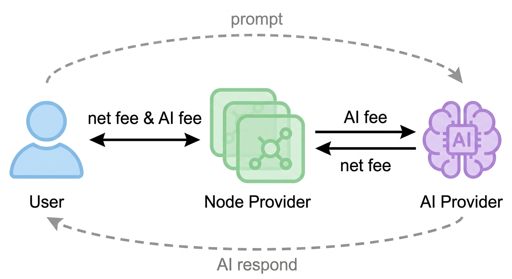

# PrivacyAI
Decentralized anonymous AI network using multi-hop routing (inspired by Tor) and mixed crypto payments to unlink users from providers while enabling pay-per-use AI services.
# Decentralized Anonymous AI Service Network (Whitepaper Draft)

## 1. Introduction

As AI services become widely adopted, two key concerns emerge:

1. Privacy risk: AI providers can directly access user inputs  
2. Centralization: Services are controlled by a small number of platforms  

Existing anonymity networks such as Tor provide communication privacy but do not prevent service providers from accessing user data.

This proposal introduces a decentralized architecture that combines anonymous communication with cryptocurrency-based payments to reduce identity exposure and mitigate centralized control, without changing how AI inference is performed.

---

## 2. System Model

The system consists of three roles:

### A: User 
- Sends AI requests  
- Pays for services  
- Remains anonymous  

### B: AI Provider
- Performs model inference  
- Charges based on usage (e.g., tokens or compute)  
- Cannot directly identify users  

### C: Node Provider
- Form an anonymous routing network  
- Forward requests and responses  
- Handle payment aggregation and distribution  

---

## 3. Design Goals

### Core Objectives

- **Anonymity**: Providers cannot identify users  
- **Decentralization**: No central authority controls communication or payments  
- **Unlinkability**: Requests, responses, and payments are difficult to correlate  
- **Metering**: Supports usage-based billing  

### Non-Goals

- Preventing providers from accessing request content  
- Full protection against powerful adversaries  

---

## 4. Architecture

### 4.1 Communication Layer

The system uses a multi-hop routing mechanism inspired by Tor:

A → C1 → C2 → C3 → B

Properties:

- Each node only knows its immediate neighbors  
- Messages are wrapped in layered encryption (onion routing)  
- Paths are dynamically selected by the user  

---

### 4.2 Request Flow

1. Path Selection  
   The user selects a sequence of relay nodes  

2. Encryption  
   The request is wrapped in multiple encryption layers  

3. Forwarding  
   The request is relayed through the network  

4. Inference  
   The provider decrypts the final layer and processes the request  

---

### 4.3 Response Flow

Responses follow the reverse path:

B → C3 → C2 → C1 → A

- Each node re-encrypts the data  
- The user decrypts layer by layer to obtain the result  

---

## 5. Payment Model

### 5.1 Prepaid Balance

- Users deposit cryptocurrency into the system  
- A balance is maintained for future usage  
- Service is halted when the balance is insufficient  

---

### 5.2 Payment Mixing Mechanism

Payment flow:

Multiple Users → Relay Pool → Shuffled Distribution → Multiple Providers

Features:

- Aggregation of funds from multiple users  
- Randomized redistribution  
- Breaks the direct link between payer and provider  

---

### 5.3 Fee Structure

- Providers are paid based on usage  
- Relay nodes collect routing and processing fees  
- All fees are deducted from user balances  

---

## 6. Security Model

### 6.1 Threat Assumptions

Adversaries include:

1. Passive observers  
   - Can monitor traffic but do not control nodes  

2. Service providers  
   - Can access request content  
   - Cannot directly identify users  

3. Partial network adversaries  
   - Control a subset of relay nodes  
   - Perform traffic analysis  

---

### 6.2 Security Properties

- **Anonymity**: Multi-hop routing hides user identity  
- **Payment Unlinkability**: Mixing reduces traceability of payments  

---

### 6.3 Residual Risks

- Content-based identification  
- Timing correlation attacks  
- Collusion between nodes  

---

## 7. Incentive Design

### Relay Nodes
- Earn fees based on traffic volume  

### AI Providers
- Earn revenue based on compute usage  

### Users
- Prepay and consume services as needed  

---

## 8. Advantages

Compared to traditional AI services:

- No account registration required  
- Reduced identity exposure  
- Decentralized control  

Compared to pure anonymity networks:

- Includes economic incentives  
- Enables sustainable operation  

---

## 9. Limitations

- Providers can access plaintext data  
- Limited resistance to advanced traffic analysis  
- Anonymity depends on network size  
- Additional latency and overhead  

---

## 10. Conclusion

This system presents a decentralized architecture for anonymous access to AI services by combining multi-hop routing with mixed cryptocurrency payments.

It improves user anonymity and reduces centralized data control, while acknowledging that it does not provide full data privacy.
